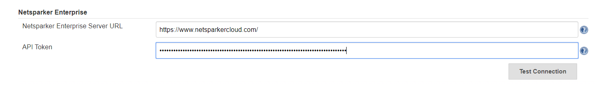
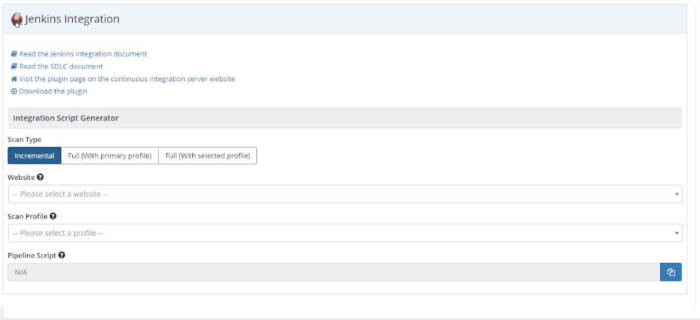
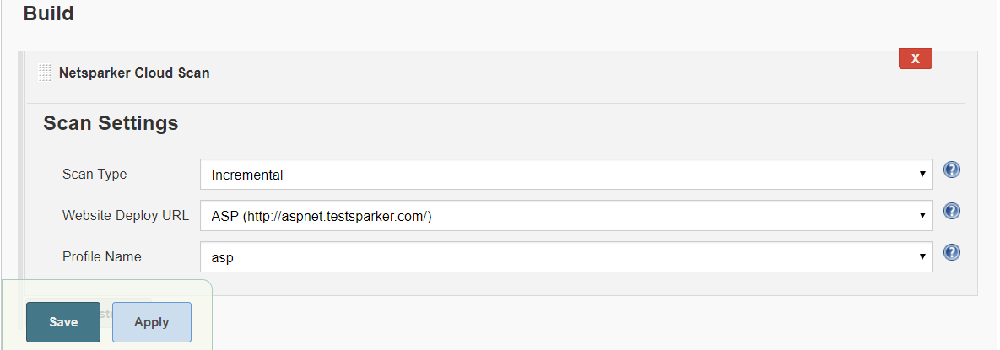
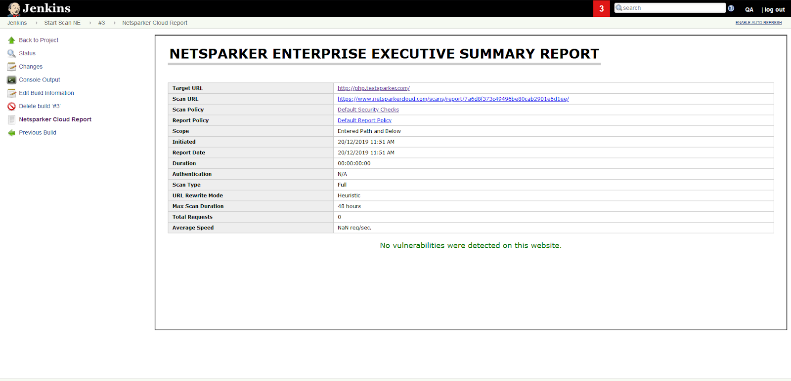

# Netsparker Enterprise Jenkins Plugin

## About this plugin

Allows users to start security scans via Netsparker Enterprise and see their
reports in Jenkins

## Features

### Global Settings

Netsparker Enterprise plugin needs the admin user to define the API settings
only once.

### Global Settings Override

Global settings can be overridden in pipeline scripts by
giving ncApiToken and/or ncServerURL parameters.

#### Example Script

step([$class: 'NCScanBuilder', ncScanType: 'FullWithPrimaryProfile', ncWebsiteId: '19011b1b-4141-4331-8514-ab4102a4c135'])

### Scan Settings

Once you define global API settings, the plugin retrieves available
scan settings such as scannable website list and scan profile names. You
can easily select relevant settings.

### Scan Report

Once your initiated scan is completed, you can easily see your
executive scan report on the build result window.

## Requirements

In order to use the Netsparker Enterprise scan plugin, following requirements
needs to be satisfied:

- The user must have API token which has permission to start security
  scan.

- The token belongs to the Netsparker Enterprise account must have at least one
  registered website.

## User Guide

Netsparker Enterprise Jenkins Plugin documentation is available at:

https://www.netsparker.com/support/integrating-netsparker-enterprise-scan-jenkins-plugin/

Netsparker Enterprise SDLC documentation is available at:

https://www.netsparker.com/support/integrating-netsparker-enterprise-SDLC/
